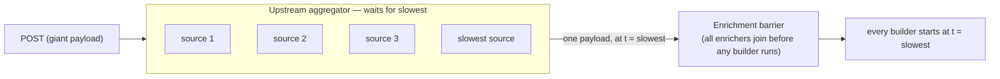
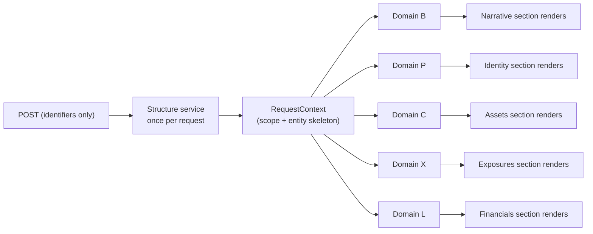
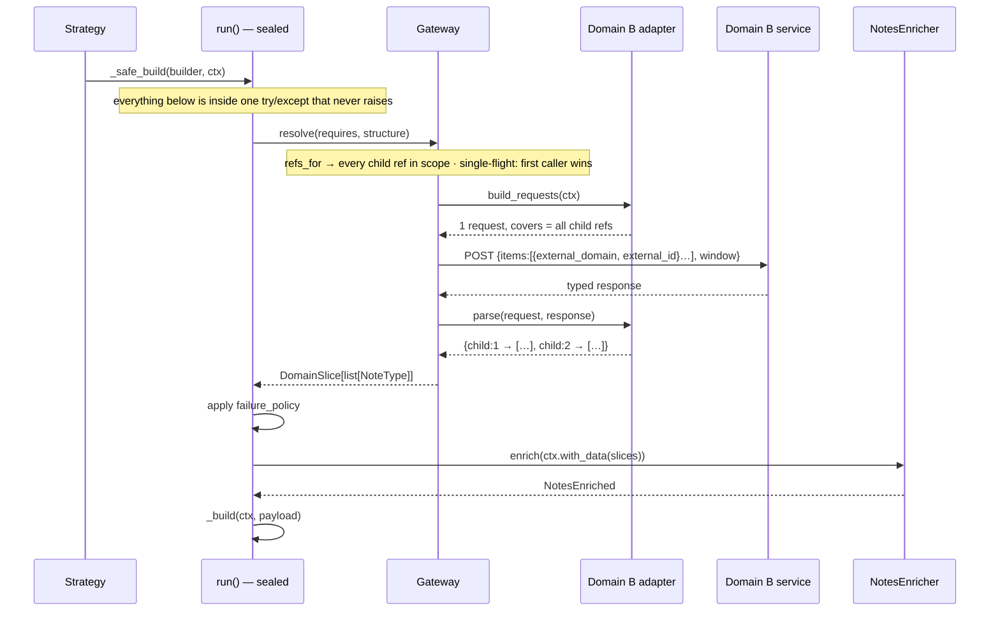

# Declarative Per-Section Data Acquisition — Design

> **Status: design only. No code exists.** This single document is the whole deliverable.
>
> **What it is.** A pattern for a service that composes a multi-section document from many upstream
> data sources, where each section declares the data it needs and a standalone gateway package fetches
> exactly that — lazily, in parallel, per source — so each section renders the moment its own data
> lands.
>
> **How it is written.** Every entity, service and field is named by its *role*, not its real name.
> Domains are named by the *shape of their contract* (per-entity, batch, parent-keyed, dependent…) so
> each worked example illustrates a mechanism. A binding sheet at the end (§25) maps roles to real
> names; fill it in where the real code lives. Nothing architectural depends on the real names.

---

## Part I — The service redesign

## 1. The problem

Sometimes The composing service is well factored *inside* its boundary: skeleton-first acknowledgement,
independent section builders, a pluggable execution strategy, progressive persistence. The wall is
*outside* it.

Today every byte of domain data might arrive pre-aggregated in the request body. An upstream aggregator
fans out to N source services, **waits for the slowest**, and returns one payload. So:

- Wall-clock latency ≈ `max(all sources)` — several minutes.
- **No section can start until every source has answered.** A section that needs one fast source
  waits on the slowest unrelated one.
- **The payload grows without bound.** Each new upstream source adds another branch to a request body
  already thousands of lines long. It is no longer manageable as an input.

### 1.1 Two barriers, one of them ours



The second barrier is inside the service: the orchestrator awaits a single `enrich_all()` to
completion before entering the build loop, and that coordinator joins every sub-enricher in a task
group. It is free today — pure in-memory walks over an already-materialised payload — but becomes a
second `max(all sources)` wall the instant enrichment means network I/O. **Removing it is the heart of
this change.**

### 1.2 The target



Same total work, same slowest source — but each section is on screen as soon as *its own* domain
lands.

---

## 2. Decisions (locked)

| # | Decision | Choice |
|---|---|---|
| D1 | **Request body** | Four identity scalars — `request_id`, `subject_id`, `relationship_id`, `scope_kind` — plus a `caller` object (caller id, preferences) kept as the extension point. The data payload leaves the contract entirely. |
| D2 | **Transport** | Direct REST to each source service. The aggregator is bypassed. |
| D3 | **Where the fetch happens** | Inside each section's own sealed build path. A section resolves → enriches → renders as one unit; data is fetched lazily, only when that section runs. |
| D4 | **Call granularity** | One call per domain where the service allows it, declared per domain as `BATCH` or `PER_ENTITY`. Per-entity services are fanned out by the gateway and merged. |
| D5 | **Dependency declaration** | Static, typed, class-level: `requires = (keys.B,)` — a typed `DomainKey[T]` used for both declaration and lookup. No runtime component ever chooses a fetch. |
| D6 | **Builder input** | A shared `RequestContext` (once-fetched skeleton + scope) plus a per-section typed view of only its declared domains. |
| D7 | **Failure semantics** | Per-section declared policy: `HARD_FAIL` / `PARTIAL` / `BEST_EFFORT`. Applied policy is recorded. |
| D8 | **Retry** | In the gateway, per service operation, entirely configuration — on/off, attempts, backoff, retryable statuses. |
| D9 | **Migration** | Big bang: the structure call and all domain adapters ship together. Offline mode (D11) makes this safe to build before upstream exists. |
| D10 | **Upstream inventory** | This document specifies the contracts required; endpoints are configuration filled in later. |
| D11 | **No upstream access yet** | Offline-first via a mock **transport** injected into the real HTTP client. One gateway implementation; only the network hop is faked. |
| D12 | **Caching** | In-request single-flight only, keyed `(domain, entity-set)`; caches failures too. Cross-request caching is a future door. |
| D13 | **Deadlines** | Per-attempt timeout per domain + an overall request deadline. A request always reaches a terminal state. |
| D14 | **Packaging** | The gateway is a standalone distributable package. The service depends on it; it never imports the service. |
| D15 | **Auth** | The caller's bearer token is captured at the API boundary, carried on `RequestContext`, and attached to every upstream call. |
| D16 | **Service configurability** | Verb, binding, URL, timeout, retry and concurrency are configuration. An adapter only builds the typed payload. |
| D17 | **Unified build path** | One sealed entry point for sections *and* sub-sections; the existing second path is removed so resolution cannot be skipped. |
| D18 | **Execution regrouping** | Required, not an optimisation: execution groups run serially, so lazy fetching turns them into a *sum* of latencies. Default: one group, flush per section. |
| D19 | **Inter-domain dependencies** | `depends_on` on the adapter is the *only* way one domain may use another's output. Section ordering is never used for this. |

---

## 3. The data shape

### 3.1 Hierarchy

```
Request
├── request_id, subject_id, relationship_id, scope_kind, caller{id, preferences}
└── payload                               ← THIS IS WHAT GOES AWAY
    └── subjects: list[Subject]
        ├── (identity fields)
        ├── domain L payload              ← parent-level
        ├── domain X payload              ← parent-level (X is dual-level)
        └── relationships: list[Relationship]
            ├── (identity fields)
            ├── domain P payload  ┐
            ├── domain C payload  │
            ├── domain M payload  ├── child-level
            ├── domain X payload  │
            ├── domain B payload  │
            └── domain Q payload  ┘
```

Two entity levels: **Subject** (parent) and **Relationship** (child). Three scope kinds:

| Scope | Composition | Where identity lives |
|---|---|---|
| `GROUP` | one group Subject **plus** its 1:n member Subjects, in one flat list, discriminated by a type field — the group is a Subject like any other | the Subject |
| `SINGLE` | one Subject | the Subject |
| `STANDALONE` | one Subject with exactly one Relationship | **the Relationship** |

The last row is why the request carries *both* ids (D1): one contract serves all three scopes without
the caller branching.

### 3.2 The skeleton

The **Structure service** returns the entity tree — Subjects, their Relationships, and every scalar
identity field on both — with no domain payloads. It is fetched **once per request**, is the only
blocking call, and is what makes scope resolution and every downstream id derivation possible.

The skeleton is **whatever the Structure service's published response says**, not something derived
by subtracting fields from the old payload. Subtraction survives only as an expectation the ingest
asserts: if a domain payload *does* arrive, that is a contract violation and fails immediately.

> **The Structure service is the identity provider.** Every downstream request is built from
> service-specific identifiers (Domain P needs an attribute from the parent Subject *and* one from the
> Relationship; Domain B needs an external `(domain, id)` pair). None can be invented — all must
> arrive with the skeleton. That is a materially stronger contract than "the tree", and it is stated as
> a requirement on upstream (§7).

### 3.3 Who needs what

Derived by reading every enricher for the fields it touches. Illustrative roster — rebuild the exact
map at the real code in ten minutes by grepping the enrichers.

| Section | Sub-section | Declared domains | Level |
|---|---|---|---|
| Identity | — | `P` | child |
| Exposures | Summary | `X` | parent + child |
| | Utilisation | `X` | parent + child |
| | Detail | `X`, `C` | child |
| Financials | Ratios | `L` | parent |
| | Capacity | `L` | parent |
| Decision | — | `Q` | child |
| Assets | Holdings | `C` | child |
| | Valuation | `C` | child |
| Narrative | Profile *(generative)* | `M` | child |
| | Notes *(generative)* | `B` | child |
| **Activity** *(new)* | — | `D` — **depends on `X`** | child |

Three facts drive the design:

1. **`X` is dual-level** — read at both parent and child, merged. The domain key must support both
   levels in one result.
2. **Sharing is real** — `C` by three sections, `X` by three, `L` by two. Single-flight (D12) is not an
   optimisation; it is required to avoid triplicating upstream load.
3. **Every section needs the skeleton, and nothing else is universal.**

**Total upstream calls per request: 1 + number of domains** (structure + one per domain), against one
giant call today — but only the structure call gates *starting*, and each domain gates only its own
sections.

---

## 4. Architecture — the service side

### 4.1 Keys: declaration and lookup use one token

```python
class BaseEnricher[T](ABC):
    requires: ClassVar[tuple[DomainKey[Any], ...]] = ()

    @abstractmethod
    async def enrich(self, ctx: RequestContext) -> T: ...
```

The gateway exports one typed `DomainKey[T]` per domain (§14.1), so the thing an enricher declares is
the thing it looks data up with:

```python
notes = ctx.data[keys.B]        # statically DomainSlice[list[NoteType]] — no cast, no Any
```

Using one token for both makes "accessed ⊆ declared" hard to violate by accident. An undeclared
domain still raises `UndeclaredDomainError` at runtime, and a recording test covers the set membership
a type checker cannot prove.

### 4.2 Request context

```python
@dataclass(frozen=True, slots=True)
class RequestContext:
    request_id: str
    caller: Caller
    scope: Scope              # unchanged rules — now seeded from the skeleton, not the payload
    structure: Structure      # the once-fetched skeleton
    gateway: Gateway          # the per-request stack (single-flighted, credentialed)
    data: DomainData          # typed view of the slices resolved for the section currently running
```

**Scope rules survive unchanged.** Validation moves from "validate the payload we were handed" to
"validate the structure we fetched", and stays in one place.

### 4.3 Failure policy

```python
class FailurePolicy(StrEnum):
    HARD_FAIL = "HARD_FAIL"      # any failed entity → section FAILED
    PARTIAL = "PARTIAL"          # proceed with what returned → PARTIALLY_COMPLETED + note
    BEST_EFFORT = "BEST_EFFORT"  # proceed regardless → COMPLETED
```

Declared per section builder — it is a business statement about that section's output, not about the
data. A partial exposures table is actively misleading; a partial narrative is fine. Starting
assignment: Exposures and Financials `HARD_FAIL`; Assets, Identity, Decision `PARTIAL`; Narrative
`BEST_EFFORT`.

### 4.4 Execution — one sealed path, and the defect it fixes

`_run_background` becomes:

```python
structure = await gateway.structure(ClientRef.of(request))
scope     = resolve_scope(request.scope_kind, structure)          # same rules, new input
ctx       = RequestContext(...)

async with asyncio.timeout(settings.request_deadline_seconds):
    async for batch in strategy.execute(builders, ctx):
        await repository.update_sections(request_id, [...])
```

**Resolution happens inside one sealed entry point shared by sections and sub-sections** (D17). This
required fixing a latent defect: the existing framework has **two** build paths — a sealed `build()`
that wraps everything, and a child-build helper that calls the builder's inner `_build()` **directly**,
bypassing the seal. Invisible today, because all data is pre-materialised. The moment resolution lives
in `build()`, every sub-section silently gets no data — and **most enrichers belong to sub-sections.**

A sub-section is a section that renders into a different DTO; the lifecycle should not differ:

```python
class SectionBuilder(ABC):
    enricher: ClassVar[BaseEnricher[Any] | None] = None
    failure_policy: ClassVar[FailurePolicy] = FailurePolicy.HARD_FAIL

    async def run(self, ctx: RequestContext) -> BuildOutcome:   # SEALED — the ONLY entry point
        try:
            payload = None
            if self.enricher is not None:
                slices = await resolve(ctx.gateway, self.enricher.requires, ctx.structure)
                self._apply_failure_policy(slices)              # HARD_FAIL raises here
                payload = await self.enricher.enrich(ctx.with_data(slices))
            return BuildOutcome.ok(await self._build(ctx, payload), logs=...)
        except Exception as exc:
            return BuildOutcome.failed(exc, logs=...)
```

`run()` returns a DTO-neutral outcome; the strategy assembles a top-level one into a section DTO, a
composite parent assembles its children's into sub-section DTOs. **Resolution cannot be skipped
because there is only one way in.**

Three properties follow:

- **One failure boundary.** Fetch, enrich and render failures all land in the `except` that already
  exists. No new error plumbing anywhere.
- **Policy applied where declared.** `HARD_FAIL` raises inside `run()` and becomes a `FAILED` section.
- **The deadline reuses the existing error path.** A timeout breach lands in the orchestrator's
  existing `except`, which already fails incomplete sections and sets terminal status.

| Component | Responsibility |
|---|---|
| Orchestrator | Fetch structure once, capture token, build context, hold the deadline |
| Execution strategy | *Schedule* units and flush batches. **No data awareness.** |
| `SectionBuilder.run()` | **Orchestrate**: resolve → policy → enrich → `_build`; contain every failure |
| Gateway (per-request) | **Perform**: derive refs, single-flight, retry, call upstream, key results |
| Enricher | **Shape**: slices → one typed payload. No I/O. |
| `_build()` | Render. Sees only the typed payload. |

Because resolution sits behind `run()`, an excluded section never runs and **never triggers its
fetch** — exclusion needs no mechanism of its own.

### 4.5 Section ordering — what it is for, and one trap

| Mechanism | Controls | Use for data flow? |
|---|---|---|
| display order | where a section appears in the response | No — presentation |
| execution groups + flush policy | *when* a section runs and flushes | **No** |
| `depends_on` | resolution order between domains | **Yes — the only one** |

Grouping is the right tool for *what the user sees first*. It is the wrong tool for data
availability, and the design makes it unusable as one: an adapter's `ctx.deps` contains *only* what it
declared, so a section can never obtain data merely because another ran first.

> ⚠️ **The trap: groups run serially, so with lazy fetching they add up.** The execution strategy
> iterates `for group in groups:` and awaits inside — group N+1 does not start until N finishes. Free
> today (pure CPU). **After this redesign each group waits on its own upstream calls**, and total
> latency becomes the *sum of group maxima* rather than the max over all domains.
>
> The current arrangement — several serial groups of mutually independent sections — would serialise
> independent fetches and cancel most of the parallelism this redesign exists to create.
> **Regrouping is part of the change** (D18): default one group, flush per section; reintroduce
> grouping only with a stated reason.
>
> Related: a dependent section inside a *flush-on-group-complete* group holds up every sibling in
> that group. Dependent sections belong in flush-per-section groups.

### 4.6 What carries data between sections

Nothing new, nothing persisted. **`ctx.data` being section-scoped is a visibility rule, not a storage
rule.** Storage is request-scoped, in the single-flight cache inside the per-request gateway.

| Scope | Holder | Contains |
|---|---|---|
| one section | `ctx.data` — a *view* | only that section's declared domains |
| one request | single-flight cache in the per-request gateway | every `(domain, refs)` resolved so far, by anyone |
| beyond | *nothing* | deliberate (D12) |

**Why it works in any order:** the cache key is `(domain, refs)`, and refs are derived from *the
domain's levels plus the structure* — never from the caller. Two sections asking for `X` compute an
identical key: whoever asks first pays; concurrent askers await the same in-flight task. One upstream
call either way, no ordering assumption. `depends_on` adds only *sequencing*; it adds no carrier.

> **Separate concern.** Today the stored request *was* all the data, so it doubled as the provenance
> record and a replay source. After D1 it is four scalars. Whether audit/replay still need the fetched
> payloads is OQ-5 — if so, a separate TTL'd collection, never the summary document, which is read on
> every poll.

### 4.7 Worked example — the Notes sub-section, end to end

**The enricher.** Compare with today's: the grouping logic is *unchanged*; only the source moves:

```python
class NotesEnricher(BaseEnricher[NotesEnriched]):
    requires = (keys.B,)

    async def enrich(self, ctx):
        by_child = ctx.data[keys.B].by_id(EntityLevel.CHILD)
        per_subject = []
        for subject in ctx.scope.subjects:                        # skeleton records
            notes = []
            for rel in subject.relationships or []:
                notes.extend(by_child.get(rel.relationship_id, []))   # ← was rel.notes
            if notes:
                per_subject.append(SubjectNotes(subject.subject_id, subject.name, notes))
        return NotesEnriched(per_subject=per_subject)
```

**That one-line substitution is the whole migration for this enricher.** Same child id as the key, so
output is identical by construction. It is the shape every migration should take — where one does not
look like this, the domain's response type diverges from today's payload type (PG-4).

**The builder:**

```python
class NotesBuilder(GenerativeSubSectionBuilder):
    enricher = NotesEnricher()
    failure_policy = FailurePolicy.BEST_EFFORT
```

**Resolution, before `enrich` is ever called:**



The enricher never names an id list, chooses a window, knows the transport, or knows that another
sub-section is concurrently hitting a different service.

---

## 5. Request contract (breaking)

```python
class InitiateRequest(BaseModel):
    # identity — the only data inputs
    request_id: UUID
    subject_id: str
    relationship_id: str
    scope_kind: ScopeKind            # GROUP | SINGLE | STANDALONE
    # caller context — the extension point
    caller: Caller | None = None     # caller id + preferences (output language, exclusions, …)
```

From thousands of lines to four scalars plus caller context. **`caller` stays**: it preserves three
live behaviours — section/sub-section exclusion, generative output language, and the caller id
persisted on the document. The identity quartet says *what* to summarise; `caller` says *for whom and
how*. This is a change to a separately published model package and lands there first.

---

## 6. What changes, what does not

**Touched**

| Area | Change |
|---|---|
| gateway package | **New** (Part II) |
| enricher base | `requires`; `enrich(ctx)` |
| enrichment coordinator | **Deleted** — its join is the barrier |
| monolithic payload type | **Dissolves** into per-section views + `RequestContext` |
| scope module | Same rules; input becomes the structure |
| every enricher | Read `ctx.data[key]` instead of walking the payload; logic otherwise unchanged |
| builder base | **Framework refactor (D17):** two paths → one sealed `run(ctx)`; `enricher` + `failure_policy` declarations |
| every builder | `_build(ctx, payload)` signature; declarations. Rendering unchanged |
| execution strategy | Parameter type and `build`→`run`. No behavioural change |
| orchestrator | Structure call + deadline; drops the barrier |
| composition root | Wire gateway; pair builders with enrichers; **regroup execution (D18)** |
| settings | Gateway selection, per-domain endpoints/timeouts/retry/concurrency, deadline |

**Explicitly NOT changing** — the response DTOs and polling contract; the never-raise guarantee and
sub-section status derivation; flush-policy semantics and progressive persistence; formatters,
mapper, evaluator, persistence layer, prompt management, LLM layer; scope *rules*; section content,
headings, display order.

---

## 7. The ask to upstream

Each service publishes its own typed **request and response** in the shared model package. Requests
are *not* id lists — they carry service-specific identity attributes and query parameters. "Child
level" / "parent level" describes the granularity a service is *keyed at*, not its request shape.

**Common:** REST/JSON typed by the published model · response keyed by entity · *no data for this
entity* distinguished from *failed for this entity* · no pagination.

| Service | Keyed at | Cardinality | Returns |
|---|---|---|---|
| Structure | — | single | The skeleton **plus every identity attribute any service needs** (below). For `GROUP`, the group Subject *and* its members in one flat list. |
| P | child | `PER_ENTITY` | one value per child |
| B, C, M, Q | child | `BATCH` | a list per child |
| X | parent **and** child | `BATCH` | one value per parent *and* per child, one response |
| L | parent | `BATCH` | a list per parent |
| D | child | `BATCH` | a list per child; **input built from X's output** |

Cardinality is confirmed per service as its real contract lands — one registry line each.

**Identity attributes the Structure service must return:** for each Relationship — its primary id, an
external `(domain, id)` pair, a standardised id, any legacy id, **and attribute α**; for each Subject —
its primary id, a standardised id, group id, source system.

> ⚠️ **Attribute α is not on the published child model today.** Domain P's request needs it. Either it
> joins the model via the Structure service, or it requires a separate lookup the gateway must
> sequence *before* P — the `depends_on` mechanism (§16.2) supplies exactly that ordering.

**Timeouts:** no SLA data exists yet; every domain starts on one default. §19.2's duration histogram
*becomes* the SLA data after a week in production.

---

## 8. Cross-cutting owners

| Concern | Owner |
|---|---|
| Retry | Gateway `RetryGateway` decorator, per-operation config |
| Per-attempt timeout | Gateway `TimeoutGateway`; clock starts at dispatch, not enqueue |
| Request deadline | Orchestrator — `asyncio.timeout`, reusing the existing failure path |
| De-duplication | `SingleFlightGateway`, per request, caches failures |
| Concurrency | Per-domain semaphore in the dispatch loop |
| Auth | Token captured at the API boundary, carried on `RequestContext`, attached by the transport |
| Telemetry | §19 |
| Failure → section status | Sealed `run()` + declared policy |
| Correlation | Existing context-var binding, propagated as a header |

---

## 9. Preservation of properties

| Property | How it survives |
|---|---|
| Skeleton-first acknowledgement | Unchanged |
| Per-section independence | **Strengthened** — no shared enrichment barrier |
| Pluggable execution strategy | Unchanged semantics |
| Progressive persistence | Unchanged, and finally load-bearing |
| Schema-driven typing | **Strengthened** — upstream contracts are the published classes verbatim |
| Dependency injection | Unchanged |
| Builders never raise | Unchanged, and now also absorbs upstream failures |

---

## 10. Trade-offs and rejected alternatives

- **Declaration enforcement.** Typed keys make every *access* statically typed, but no checker proves
  the accessed *set* equals the declared set. *Rejected:* per-enricher generic signatures — statically
  total, but breaks the uniform ABC. *Mitigation:* runtime guard + recording test.
- **Lazy proxy fields on the monolithic payload** — *rejected*: hides I/O behind attribute access;
  keeps a type whose shape lies.
- **Enricher merged into builder** — *rejected*: loses the extraction/presentation testability seam.
- **Our own per-entity fan-out for batch-capable services** — *rejected* in favour of D4.
- **Going through the aggregator with granular endpoints** — *rejected*: keeps us dependent on the
  team whose aggregation is the bottleneck.
- **Dual-mode / incremental migration** — *rejected*: with the payload gone (D1) every section loses
  its source at once; a shim would only replay stored payloads, which offline mode does better.
- **Gateway inside the service package** — *rejected*: the data has no service-specific semantics;
  a package boundary keeps that true.
- **Cross-request caching** — *deferred*, see §11.

## 11. Future doors

| Option | Trigger |
|---|---|
| Cross-request TTL cache for slow-changing domains | Repeat-request rate on the same subject makes single-flight-only the dominant cost |
| Streaming/SSE instead of polling | Only if the response contract changes — out of scope |
| Exposing the gateway as a tool server for agentic builders | If runtime tool selection is ever needed; D5 keeps the shape compatible |
| Per-entity degradation inside a `BATCH` domain | If upstream returns per-id errors often |
| Circuit breaker per domain | Sustained error rate on any domain in production (§24) |
| Declarative adapter shortcut | Rule of three (§20.4) |

## 12. Open questions

| # | Question | Blocks |
|---|---|---|
| OQ-1 | Does a risk-rating attribute on the Relationship arrive with the Structure service, or from a separate service? | Structure contract, Identity section |
| OQ-2 | Confirm per-service cardinality and binding as real contracts land | Registry, one line each |
| OQ-3 | **Attribute α is absent from the published child model.** Add it, or resolve via a lookup? | Structure contract, Domain P |
| OQ-4 | Which domain does D depend on, and which of its fields form D's request? | D's adapter |
| OQ-5 | Do audit/replay still need fetched payloads after D1 empties the stored request? | Persistence scope only |

## 13. Build order and acceptance

**Order** — steps 1–8 need no upstream access:

1. Package skeleton, wheel entry, `py.typed`, no-service-import guard
2. Domain catalogue: `DataDomain`, `EntityLevel`, `Cardinality`, `RequestBinding`
3. Port + result types: `Gateway`, `EntityRef`, `DomainSlice`, `Structure`, `DomainKey`
4. Fixture slicer + `FixtureTransport` — invert existing full-payload fixtures into canned response
   bodies. **Everything downstream is now buildable.**
5. `Structure` + scope re-seat; existing scope tests port over
6. `RequestContext` + `DomainData` view + the accessed⊆declared recording test
7. Enricher migration, one at a time against the fixtures; existing tests are the oracle
8. Builder + strategy re-wire: unified `run()`, declarations, decorators; **regroup per D18**; verify
   with a latency profile that total time tracks the slowest *domain*, not the sum of groups
9. Request contract + deadline + composition-root wiring — the cut-over
10. Real endpoints: configuration only

**Acceptance**

1. `POST` returns `202` + skeleton in <100 ms; no domain call on the request path
2. With a latency profile, a section whose domains returned is visible via `GET` **before** slower
   domains return
3. `C` fetched **once** per request despite three declaring sections; likewise `X` (3), `L` (2)
4. Undeclared domain access fails loudly (test + runtime guard)
5. An injected fault on one domain fails only its declaring sections
6. Each failure policy observably honoured and recorded
7. Deadline breach → terminal state, pending sections `FAILED`
8. Excluding a section suppresses its fetch when no other section declares the domain
9. Rendered content byte-identical to today's for every domain whose response type matches the
   payload type; elsewhere the enricher absorbs the mapping and expected output is restated
10. Offline → live is configuration only
11. GET↔POST for a service is configuration only
12. The caller's token reaches every upstream call
13. A domain declared by three sections is retried **once** on failure, not three times
14. Every sub-section resolves its domains — a test asserts no builder reaches `_build` without
    resolution having run
15. **With per-domain latencies, end-to-end time ≈ slowest declared domain, not the sum of execution
    groups** — the criterion that distinguishes a working redesign from a relocated bottleneck
16. A `depends_on` domain is fetched once and shared; the dependent's completion time is
    `dependency + own` and its failure propagates
17. The gateway package imports nothing from the service (enforced)

---

## Part II — The gateway package

## 14. Core types

### 14.1 Addressing

```python
class EntityLevel(StrEnum):
    PARENT = "PARENT"       # Subject
    CHILD = "CHILD"         # Relationship

@dataclass(frozen=True, slots=True)
class EntityRef:
    """Canonical, hashable address. Keys results and single-flight — never sent on the wire."""
    level: EntityLevel
    id: str

@dataclass(frozen=True, slots=True)
class ClientRef:
    """The request's identity triple — the sole input to the structure call."""
    subject_id: str
    relationship_id: str
    scope_kind: ScopeKind

@dataclass(frozen=True, slots=True)
class DomainKey[T]:
    """Typed handle for one domain — what a consumer declares with AND looks up with.
    T is the per-entity value type, so ctx.data[keys.P] is DomainSlice[PValue] with no cast."""
    domain: DataDomain
```

**Keys are derived from adapters, never hand-written.** Each adapter exposes `key() -> DomainKey[T]`
built from its own `domain` and its own `T`; `keys.py` is nothing but re-exports. If keys were
declared independently, the `T` in the key and in the adapter could disagree and nothing would notice.

**Entity-level is a keying concept, not a wire format.** `EntityRef` is never sent upstream; building
the typed wire request is each adapter's job (§16). Per-entity identity attributes are read from the
published records via structure navigation (§14.4) — there is deliberately **no** `EntityIdentity`
class unioning every identifier across every service: it would be a type we invented, all-Optional by
construction, growing with each source, and it would hide a missing attribute like α behind a
silently-`None` field.

### 14.2 The adapter — one class is the complete definition of a domain

```python
class Cardinality(StrEnum):
    BATCH = "BATCH"; PER_ENTITY = "PER_ENTITY"

class RequestBinding(StrEnum):          # configured per service, never on the adapter
    POST_JSON = "POST_JSON"; GET_QUERY = "GET_QUERY"; GET_PATH = "GET_PATH"

class DomainAdapter[TReq, TResp, T](ABC):
    # non-generic facts: ClassVar
    domain: ClassVar[DataDomain]
    levels: ClassVar[frozenset[EntityLevel]]
    cardinality: ClassVar[Cardinality]
    depends_on: ClassVar[tuple[DataDomain, ...]] = ()
    # generic facts: plain class attributes — ClassVar may not contain a type variable (mypy --strict)
    request_model: type[TReq]
    response_model: type[TResp]

    def build_requests(self, ctx: ResolutionContext) -> Sequence[OutboundRequest[TReq]]: ...
    def parse(self, request: OutboundRequest[TReq], response: TResp) -> Mapping[EntityRef, T]: ...

    @classmethod
    def key(cls) -> DomainKey[T]: return DomainKey(cls.domain)
```

An earlier draft split this into a spec dataclass plus an adapter — two registries keyed by the same
enum that could drift. They describe one service; they are one declaration. The registry is the set of
adapters; an import-time guard asserts every `DataDomain` has exactly one, and topologically sorts
`depends_on`, rejecting cycles.

**GET vs POST is configuration.** `RequestBinding` lives on the endpoint config (§21); the adapter
always produces a typed request object and never touches HTTP.

### 14.3 Results

```python
@dataclass(frozen=True, slots=True)
class DomainSlice[T]:
    domain: DataDomain
    values: Mapping[EntityRef, T]
    missing: frozenset[EntityRef]      # asked, upstream has none — normal
    failed: Mapping[EntityRef, str]    # asked, upstream errored — degradation
    def by_id(self, level: EntityLevel) -> Mapping[str, T]: ...
```

**`missing` vs `failed` is load-bearing.** "This child has no notes" must never trigger a failure
policy; "the service returned 503 for this child" must. Collapsing them makes every sparse entity look
degraded. Only `failed` reaches policy.

### 14.4 Structure

```python
@dataclass(frozen=True, slots=True)
class Structure:
    subjects: tuple[Subject, ...]                    # the published records, as returned
    @classmethod
    def from_response(cls, r: StructureResponse) -> Structure: ...   # raises on domain payloads present
    def refs(self, level: EntityLevel) -> frozenset[EntityRef]: ...
    def subject(self, ref) -> Subject: ...
    def relationship(self, ref) -> Relationship: ...
    def owning_subject(self, child_ref) -> Subject: ...   # Domain P needs a PARENT attribute for a CHILD request
```

A wrapper, not a bare alias: reading a domain field off a structure would yield `None` — silently
empty rather than loudly wrong. `owning_subject` exists because Domain P proves a child-keyed request
can need a parent attribute.

> ⚠️ If the Structure service publishes its own Subject/Relationship types rather than reusing the
> shared ones, scope resolution must be re-typed — rules unaffected, but "scope survives unchanged" is
> only true if the types coincide (PG-8).

### 14.5 Id-set derivation

```python
def refs_for(key: DomainKey[Any], structure: Structure) -> frozenset[EntityRef]:
    return frozenset().union(*(structure.refs(l) for l in REGISTRY[key.domain].levels))
```

**No consumer ever computes an id list.** "All children under these subjects" falls out of the
domain's levels plus the structure — one rule, one place, correct for every scope kind.

## 15. The port

```python
class Gateway(Protocol):
    async def structure(self, ref: ClientRef) -> Structure: ...
    async def fetch[T](self, key: DomainKey[T], structure: Structure) -> DomainSlice[T]: ...

async def resolve(gateway, keys: Collection[DomainKey[Any]], structure) -> Mapping[DataDomain, DomainSlice[Any]]:
    """Fetch several domains concurrently, dependency-ordered. One failing must not cancel the others."""
```

> **A failed *call* raises. A failed *entity* is reported in the slice.** This one rule decides every
> error question and keeps failure *policy* on the consumer's side of the boundary.

## 16. Transport tier

Every adapter implements exactly **three mappings**: structure → typed request (`build_requests`),
typed response → per-entity value (`parse`), result → owning entity (`OutboundRequest.covers`).

```python
@dataclass(frozen=True, slots=True)
class OutboundRequest[TReq]:
    payload: TReq
    covers: frozenset[EntityRef]              # entities this call is expected to answer for
    path_params: Mapping[str, str] = field(default_factory=dict)

class PerEntityAdapter[TReq, TResp, T](DomainAdapter[TReq, TResp, T]):
    """PER_ENTITY services whose response answers for the one covered entity: write build_requests + a one-line extract."""
    def parse(self, request, response):
        (ref,) = request.covers
        return {ref: self.extract(response)}
```

**`PER_ENTITY` — Domain P**, needing a parent attribute:

```python
class PAdapter(PerEntityAdapter[PRequest, PResponse, PValue]):
    domain = DataDomain.P; levels = frozenset({EntityLevel.CHILD}); cardinality = Cardinality.PER_ENTITY
    request_model = PRequest; response_model = PResponse

    def build_requests(self, ctx):
        return [OutboundRequest(
            payload=PRequest(
                alpha=ctx.structure.relationship(ref).alpha,                 # ⚠ attribute α — OQ-3
                relationship_id=ref.id,
                subject_id=ctx.structure.owning_subject(ref).subject_id,
            ),
            covers=frozenset({ref}),
        ) for ref in ctx.structure.refs(EntityLevel.CHILD)]

    def extract(self, response: PResponse) -> PValue:
        return response.value                                                # ← PG-4 lives here
```

**`BATCH` — Domain B**, where `parse` must attribute each element back:

```python
class BAdapter(DomainAdapter[BRequest, BResponse, list[NoteType]]):
    cardinality = Cardinality.BATCH
    def build_requests(self, ctx):
        refs = ctx.structure.refs(EntityLevel.CHILD)
        return [OutboundRequest(
            payload=BRequest(
                items=[ExternalKey(*ctx.structure.relationship(r).external_id) for r in refs],
                window_from=ctx.params.window_from, window_to=ctx.params.window_to,   # service-wide config
            ),
            covers=frozenset(refs),
        )]
    def parse(self, request, response):
        return {EntityRef.child(item.relationship_id): item.notes for item in response.results}
```

**`covers` makes cardinality a non-issue.** The gateway runs one loop:

```python
outbound = adapter.build_requests(ctx)
results  = await gather(*(self._dispatch(o) for o in outbound), return_exceptions=True)
# success → adapter.parse(o, response_model.model_validate(body)); failure → every ref in o.covers → failed
```

`BATCH` ⇒ one request covering everything, a failure fails the domain; `PER_ENTITY` ⇒ N requests
each covering one ref, a failure degrades exactly that entity. **Per-entity isolation falls out for
free, with no branch on cardinality.** `missing` is simply refs covered by a successful call but absent
from its response.

The adapter never sees HTTP and never validates: **the gateway binds per configured binding, issues,
and validates into `response_model` before `parse` is called.**

### 16.1 The HTTP client

```python
class HttpTransport:
    def __init__(self, client: httpx.AsyncClient, credentials: Credentials) -> None: ...
    async def send(self, endpoint: DomainEndpoint, binding: RequestBinding, request: OutboundRequest[Any]) -> JsonValue: ...
```

| Binding | Verb | Payload travels as |
|---|---|---|
| `POST_JSON` | POST | `model_dump(mode="json", by_alias=True, exclude_none=True)` body |
| `GET_QUERY` | GET | same dump flattened to query params |
| `GET_PATH` | GET | `path_params` into the URL template; remaining scalars → query |

`by_alias=True` is mandatory: the published models alias keyword-colliding fields, and dumping without
it silently sends the wrong key. A `GET_QUERY` domain with nested request fields is rejected at import.

**Auth — required.** `Credentials` protocol; `BearerToken(token)` is the normal path,
`NoCredentials` for offline/local only. Fetches run in a background task *after* the HTTP response
has returned, so the token is captured at the boundary during initiate and carried on
`RequestContext`. **A short-lived token can expire mid-pipeline** (PG-7): accept late failures,
exchange for a longer-lived token at initiate, or fall back to service identity — undecided; the
protocol makes any choice a construction change, not a signature change.

**TLS** via settings (`verify` path/bool); the gateway must not import the service's cert helper.

**Error translation:**

| Condition | Result |
|---|---|
| timeout | `DomainTimeoutError` |
| connect/transport error, 5xx, 429 | `DomainFetchError` — retryable per config |
| 4xx other than 404 | `DomainFetchError` — contract or permission fault |
| 404 on `PER_ENTITY` | **not an error** — covered ref → `missing` |
| 404 on `BATCH` | `DomainFetchError` — a batch endpoint should not 404 |
| body fails `response_model` | `ContractViolationError` |

**Retry** is the `RetryGateway` decorator (§18), outside this transport and inside single-flight.
**Timeout is per attempt** and the worst case `attempts × (timeout + backoff)` must fit the request
deadline — startup validation warns when it cannot.

### 16.2 Dependent domains

```python
class DAdapter(DomainAdapter[DRequest, DResponse, list[Activity]]):
    domain = DataDomain.D
    depends_on = (DataDomain.X,)                              # ← the declaration
    def build_requests(self, ctx: ResolutionContext):
        x = ctx.deps[DataDomain.X]                            # typed, already resolved
        return [OutboundRequest(payload=DRequest(accounts=[...from x.values...], window_from=ctx.params.window_from),
                                covers=frozenset(ctx.structure.refs(EntityLevel.CHILD)))]

@dataclass(frozen=True, slots=True)
class ResolutionContext:
    structure: Structure
    params: DomainParams
    deps: Mapping[DataDomain, DomainSlice[Any]]   # exactly the declared depends_on, already resolved
```

**A dependency slice is just another projection source, symmetric with the structure.** The adapter
fetches nothing and cannot reach a domain it did not declare. `resolve()` topologically orders the
graph; cycles fail at import. Because single-flight is keyed `(domain, refs)`, a dependency is fetched
**once** regardless of who asks first — the Exposures section and Domain D share one X call.

**Failure propagates down the chain**: if X fails, D raises `DependencyUnavailableError` and its
section fails under its own policy — *a dependent section is only as available as everything it
depends on.* **Latency is the reason to declare these sparingly**: D renders at `X + D`, not
`max(X, D)`; every edge is a step back toward the wall this redesign removes. Telemetry emits D's fetch
with a link to the X fetch it waited on.

`depends_on` is keyed by `DataDomain` (not `DomainKey`) deliberately — adapters referencing each
other's keys would form an import cycle with `keys.py`.

### 16.3 Bounded fan-out

A `PER_ENTITY` domain over 50 children issues 50 calls; times concurrent requests, hundreds in flight,
bounded only by the pool. **Relying on the pool fails badly: the client queues when the pool is
exhausted, and a queued request's timeout is already running.** Under load: timeouts on a healthy
service, then retry re-dispatching into the same saturated pool.

```python
sem = asyncio.Semaphore(endpoint.max_concurrency)
async def _dispatch(o):
    async with sem:                                             # queue here, un-timed
        async with asyncio.timeout(endpoint.timeout_seconds):   # clock starts now
            return await transport.send(endpoint, o)
```

`max_concurrency` is per domain and configuration.

### 16.4 Cost of a new domain

| Step | Size |
|---|---|
| Registry entry (levels, cardinality, depends_on) | ~6 lines |
| Adapter — `build_requests` + `parse`; `PER_ENTITY` with a one-entity response writes only `build_requests` + `extract` | 15–30 lines |
| Endpoint config (url, binding, timeout, retry, concurrency) | 1 block |
| Fixture | 1 file per scenario |
| Consumer | 1 `requires` line |

No existing section, enricher or adapter changes, and **the service's own request does not grow.**

## 17. Offline mode — a mock *transport*, not a mock gateway

There is **no mock gateway class.** An earlier draft had one; it bypassed `build_requests`, binding,
headers, validation, `parse`, error translation and retry — the code path proven offline was not the
one that ships. Instead, fake the network hop only:

```python
class FixtureTransport(httpx.AsyncBaseTransport):
    async def handle_async_request(self, request):
        domain = self._match(request)                                # by configured URL
        if d := self._profile.latency.get(domain):  await asyncio.sleep(d)
        if f := self._profile.faults.get(domain):   return httpx.Response(f.status)
        return httpx.Response(200, json=self._scenario.body_for(request, domain))

client = httpx.AsyncClient(transport=FixtureTransport(...) if offline else None, ...)
```

The real gateway is the *only* implementation; offline and live differ by one constructor argument —
"live is configuration only" becomes true by construction. Fixtures are **canned response bodies**
sliced from the existing full-payload fixtures, so the existing test suite stays the oracle. Latency
injection makes §1.2 observable on a laptop and verifies acceptance criterion 15; faults return real
HTTP statuses, so a 503 genuinely drives retry and a 404 genuinely exercises `missing` vs `failed`.

## 18. Decorators and the lifetime split

```
singleton (composition root)          ┌──────────────────────────────────────────┐
                                      │ httpx.AsyncClient (pool, TLS)             │
                                      │ FixtureStore (offline — immutable)        │
                                      └──────────────────────────────────────────┘
per request (orchestrator)            ┌──────────────────────────────────────────┐
                                      │ SingleFlight(Telemetry(Retry(Timeout(     │
                                      │     RestGateway(client, credentials)))))  │
                                      └──────────────────────────────────────────┘
```

**Only the pool and the immutable fixture store are singletons.** Two forces put the line there:
credentials are per request (a token cannot live on a singleton), and the single-flight cache is per
request (a process-wide cache would serve one client's data to another). Making the cache an instance
field rather than an id-keyed dict makes the correct lifetime the *only* expressible one.

**Order matters:** single-flight outside retry, so a domain shared by three sections is retried once
as a unit; timeout innermost, bounding one attempt. **Single-flight caches failures**, or three
sections × `max_attempts` would hammer a failing service.

## 19. Observability

The first component between the service and a fleet of upstream dependencies — and the first real
OpenTelemetry instrumentation in the codebase (the API is a dependency; nothing emits yet). Three
signals; ids never appear on any of them.

**Spans**

```
request (request_id, scope_kind, section_count)
├── structure (duration, subject_count, relationship_count)
├── section.NARRATIVE
│   ├── fetch.B → http.client (one per attempt)
│   └── fetch.M
└── section.ACTIVITY
    └── fetch.D  ⤷ link → fetch.X   (waited on; single-flighted, not re-issued)
```

Per-fetch attributes: `domain`, `cardinality`, `entity_count`, `request_count`,
`singleflight ∈ {miss, hit, joined}`, `outcome ∈ {ok, partial, failed, timeout, dependency_failed}`,
`missing_count`, `failed_count`, `attempts`. A joining section gets a zero-cost span with a link, so
every section's trace shows every domain it touched without double-counting.

**Metrics** (`domain` + one low-cardinality label): `fetch.count{outcome}` · `fetch.duration` (histogram)
· `attempt.count{status_class}` · `inflight` (up-down) · `queue_wait` (histogram — the §16.3 failure
mode, visible) · `singleflight.count{result}` · `entities{kind=asked|missing|failed}` ·
`dependency_wait`. **`fetch.duration` is the SLA data D13 lacks**; per-domain timeouts and
concurrency are tuned from it, in config.

**Logs** (`snake_case` events, kwargs, correlation auto-bound): `fetch_started`, `fetch_attempt`,
`fetch_retry_scheduled`, `fetch_completed`, `fetch_failed`, `dependency_failed`,
`concurrency_wait` (above a threshold only).

**Health** per domain on the existing detailed health endpoint, derived from the same counters:
`{status, error_rate_5m, p95_ms, last_success}`. **Fetch summary** per request on the document —
metadata only — what a support engineer opens first when a section is `FAILED`.

| Question | Signal |
|---|---|
| Slowest service? | `fetch.duration` p95 by domain |
| Failing, since when? | `fetch.count{failed}`; `last_success` |
| Is single-flight working? | `singleflight{hit+joined}` vs `{miss}` |
| Saturating a service, or ourselves? | `inflight` vs `max_concurrency`; `queue_wait` |
| Retry policy right? | `attempt.count / fetch.count` |
| Why did *this* section take four minutes? | trace → link to the dependency it waited on |
| Timeout budgets right? | `fetch.duration` vs configured timeout |

Package depends on the OTel **API only**; the consuming application configures SDK and exporters.

## 20. Onboarding a new REST service

Target: *an engineer new to the package adds a convention-following service in under an hour, and a
conformance suite tells them when they are done.*

**Checklist:** ① add the `DataDomain` member · ② import the published request/response pair (or its
absence is the blocker, and it is upstream's) · ③ copy the template, fill `levels`, `cardinality`,
`depends_on`, `build_requests`, `parse` · ④ register · ⑤ configure url/binding/timeout/retry/concurrency
· ⑥ add fixtures · ⑦ run `pytest -k conformance` until green · ⑧ add to one enricher's `requires`.

**Nothing outside the new adapter file and one registry line is *edited*; everything else is
*added*.** If onboarding ever requires touching another adapter, the abstraction has leaked.

**Conformance** — one parametrised suite over the registry; a new adapter is covered with zero test
code: domain has exactly one adapter · `build_requests` yields validating `request_model` instances ·
union of `covers` == `refs_for`; `PER_ENTITY` ⇒ one ref each · `parse(fixture)` keys ⊆ `covers` ·
`depends_on` exists and is acyclic · `GET_QUERY` models are flat · `attempts × (timeout + backoff) <
deadline` · full round-trip through `FixtureTransport` yields a slice with no `failed`.

**The declarative shortcut** (`declare(fields={...}, extract=...)`, zero Python per domain) is a
future door, not the default: it is a small DSL with escape hatches for everything it cannot express
(computed fields, nested batch bodies, dependency projections). **Rule of three:** write classes;
when three look identical modulo field names, extract the helper *from those three*.

## 21. Configuration and errors

```python
class RetryPolicy(BaseModel):
    enabled: bool = True; max_attempts: int = 3
    backoff_multiplier: float = 0.5; min_wait: float = 0.5; max_wait: float = 8.0
    retry_on_status: frozenset[int] = frozenset({429, 500, 502, 503, 504}); retry_on_timeout: bool = True

class DomainEndpoint(BaseModel):
    url: str; binding: RequestBinding = RequestBinding.POST_JSON      # implies the verb
    timeout_seconds: float = 30.0                                     # per attempt, from dispatch
    retry: RetryPolicy = RetryPolicy(); max_concurrency: int = 8

class GatewaySettings(BaseModel):
    transport: Literal["offline", "rest"] = "offline"; fixture_scenario: str = "group"
    base_url: str | None = None; default_timeout_seconds: float = 30.0
    endpoints: dict[DataDomain, DomainEndpoint] = {}; params: DomainParamsBundle = DomainParamsBundle()
    verify: str | bool = True; max_connections: int = 100; max_keepalive_connections: int = 20
```

Query parameters (windows, filters) are **service-wide config constants**, keeping the consumer
declaration a plain key tuple and params out of the single-flight key.

```
GatewayError
├── StructureUnavailableError    # the one failure that dooms the whole request
├── DomainFetchError             # the domain is wholly unobtainable
│   ├── DomainTimeoutError
│   └── DependencyUnavailableError
├── UnknownDomainError           # registry miss — fails at wiring
└── ContractViolationError       # e.g. structure returned domain payloads; body fails response_model
```

## 22. Module layout

```
gateway/
├── domains.py        # DataDomain, EntityLevel, Cardinality, RequestBinding
├── adapter.py        # DomainAdapter, PerEntityAdapter — transport-free
├── adapters/         # one module per domain — the complete domain definition
├── keys.py           # DomainKey per domain, derived from adapters
├── registry.py       # REGISTRY (import-time guard), refs_for()
├── models.py         # EntityRef, ClientRef, DomainSlice, Structure
├── base.py           # Gateway protocol, OutboundRequest, ResolutionContext, resolve()
├── errors.py · config.py · observability.py
├── decorators/       # single_flight, retry, timeout, telemetry
├── rest/             # gateway.py (invariant loop) · transport.py · credentials.py
├── offline/          # transport.py (FixtureTransport) · profile.py · fixtures/<scenario>/
└── testing/          # conformance.py — importable by consumers
```

Depends on: the published model package, `pydantic`, `httpx`, `opentelemetry-api`. **Nothing from the
service** — enforced by a test.

## 23. Testing

Everything is testable without upstream: registry completeness · `refs_for` table-driven across scope
kinds · structure ingest rejects domain payloads · `missing`/`failed` semantics · adapters
(`build_requests` shape per cardinality, `parse` keying) · failure attribution via `covers` · binding
placement and `by_alias` · error translation via `httpx.MockTransport` incl. the 404 split ·
credentials · single-flight dedup and failure caching · timeout · **conformance over the registry** ·
observability attributes and label cardinality · the no-service-import boundary.

## 24. Open items

| # | Item |
|---|---|
| PG-1 | Package name |
| PG-2 | **Attribute α** absent from the published child model — Domain P blocked until the Structure service supplies it or a lookup is sequenced via `depends_on` |
| PG-3 | Per-domain cardinality and binding, confirmed per real contract |
| PG-4 | **Per-entity value type per response** — where it matches today's payload type, migration is a one-line swap; where not, `parse` absorbs a mapping and that enricher's migration is larger |
| PG-5 | Risk-rating attribute: Structure service or separate? |
| PG-6 | `resolve()` failure isolation — leaning `return_exceptions=True` with per-domain error slices |
| PG-7 | Token lifetime vs multi-minute pipeline |
| PG-8 | Does the Structure response reuse the shared Subject/Relationship types? |
| PG-9 | Circuit breaker — deliberately omitted; add as one more decorator when health shows sustained degradation |
| PG-10 | Declarative adapter shortcut — rule of three |

---

## 25. Binding sheet

Fill in where the real code lives. Nothing above depends on these values.

| Role in this document | Real name |
|---|---|
| the service / composing service | |
| the published model package | |
| the gateway package | |
| Subject / `subject_id` | |
| Relationship / `relationship_id` | |
| `scope_kind` values GROUP / SINGLE / STANDALONE | |
| Structure service | |
| attribute α | |
| external `(domain, id)` pair | |
| Domain P (per-entity, needs parent attribute) | |
| Domain B (batch, child, windowed, generative input) | |
| Domain C (batch, child, shared ×3) | |
| Domain M (batch, child, generative input) | |
| Domain Q (batch, child) | |
| Domain X (batch, dual-level, shared ×3) | |
| Domain L (batch, parent, shared ×2) | |
| Domain D (batch, child, depends on X) — new | |
| Sections: Identity · Exposures · Financials · Decision · Assets · Narrative · Activity | |
| caller id / preferences / exclusions / output language | |
| orchestrator · enrichment coordinator · builder base · execution strategy · composition root · scope module | |
| existing full-payload fixtures | |
